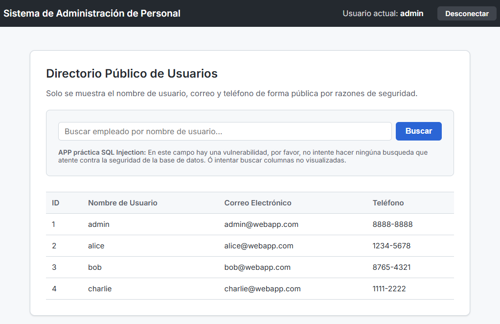

# Desarrollo de Aplicaciones Seguras 🛡️

Este repositorio contiene dos versiones de una aplicación web Flask conectada a SQL Server para demostrar vulnerabilidades comunes y sus respectivas mitigaciones.

## 📁 Estructura del Proyecto

*   **`AplicacionInsegura/`**: Contiene vulnerabilidades de SQL Injection (clásico y basado en errores) y manejo inseguro de credenciales.
*   **`AplicacionSegura/`**: Implementa consultas parametrizadas, saneamiento de entradas y manejo seguro de errores.

---

## 📷 Capturas de Pantalla

### Dashboard de la Aplicación


---

## 🚀 Requisitos Previos

*   Windows 10/11 con **PowerShell**.
*   **Docker Desktop** instalado y en ejecución.

---

## ⚙️ Configuración e Instalación

Ambas aplicaciones están totalmente containerizadas y se configuran mediante archivos `.env`.

### 1. Variables de Entorno (.env)
Asegúrate de que cada carpeta (`AplicacionInsegura/` y `AplicacionSegura/`) tenga un archivo `.env` con el siguiente contenido (ya configurado en este entorno):

```env
# Configuración de base de datos para la App
DB_SERVER=db
DB_USER=sa
DB_PASSWORD=SqlServer2026**
DB_NAME=asignacion3

# Configuración para el contenedor SQL Server
MSSQL_SA_PASSWORD=SqlServer2026**
ACCEPT_EULA=Y
```

### 2. Despliegue con Docker
Navega a la carpeta del proyecto que desees probar y ejecuta:

```powershell
# Ejemplo para la aplicación insegura
cd AplicacionInsegura
docker-compose down
docker-compose up -d --build
```

### 3. Automatización de Base de Datos
Al iniciar el contenedor `web`, se ejecutará automáticamente el script `init_db.py`. Este script:
1.  Espera a que SQL Server esté listo para recibir conexiones.
2.  Crea la base de datos `asignacion3`.
3.  Crea la tabla de usuarios e inserta datos de prueba.

Puedes monitorear el progreso con:
```powershell
docker-compose logs -f web
```

---

## 🧪 Pruebas y Uso

### Aplicación Insegura (Puerto 5000)
**URL:** `http://localhost:5000`

*   **SQL Injection en Login**: Intenta ingresar `' OR 1=1 --` en el campo de usuario.
*   **SQL Injection en Buscador**: Prueba con `admin' UNION SELECT 1, @@version, 'test', 'test' --` para extraer información del servidor.
*   **Errores Detallados**: La aplicación muestra errores de base de datos directamente al usuario, facilitando ataques basados en errores.

### Aplicación Segura (Puerto 5001)
**URL:** `http://localhost:5001`

*   **Consultas Parametrizadas**: Los ataques anteriores ya no funcionan porque se utiliza `%s` para separar el código SQL de los datos del usuario.
*   **Manejo de Errores**: Los errores se loggean internamente y el usuario solo recibe un mensaje genérico, evitando la fuga de información técnica.

---

## 👤 Usuarios de Prueba
Puedes usar las siguientes credenciales una vez inicializada la base de datos:
*   **Admin**: `admin` / `admin123`
*   **Alice**: `alice` / `alice_pass`
*   **Bob**: `bob` / `password123`
